 

A tweening library for Unreal Engine, by [Jared Cook](https://twitter.com/FreshCookedDev).


### C++:

```c++
// Generic version
FCTween::Play(
    GetActorLocation(),
    GetActorLocation() + FVector(0, 0, 50),
    [this](FVector t)
    {
        SetActorLocation(t);
    },
    2.0f,
    EFCEase::OutCubic)
    ->BindTo(this); // BindTo() makes the lambda safe

// Shortcut version
FCTween::PlayActorLocationAdd(this, FVector(0, 0, 50), 2, EFCEase::OutCubic);
```

### Blueprints:
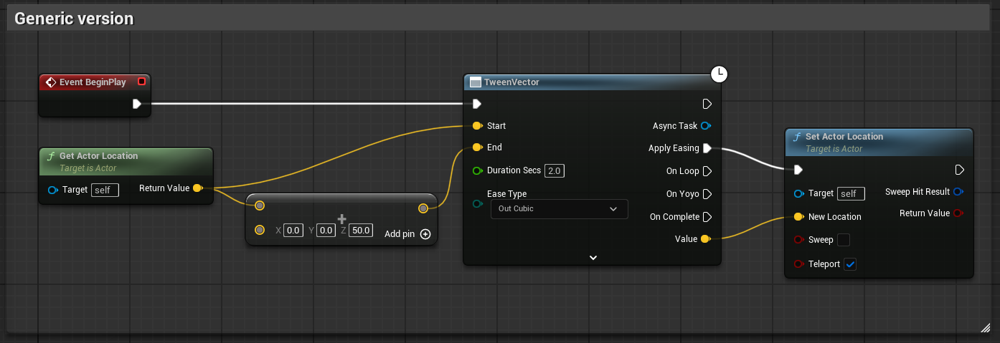
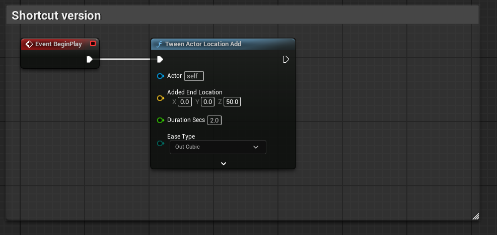

## Table of Contents
> 1. [Blueprints](#blueprintsection)
> 1. [C++](#cppsection)
> 1. [Easing Functions](#easing-functions)
> 1. [Performance](#performance)
> 1. [References](#references)
> 1. [API Reference](#api-reference)

## Why Tweens?

Tweening libraries provide convenient curve functions to ease a value be***tween*** a start and end, like a position, scale, color, or anything you want to smoothly change. They are useful in small projects and large projects. Many polished UIs have some kind of tween operating.

It can be a large efficiency gain to let a programmer or designer quickly set up a tween with easily tunable values, instead of taking up the art department's precious time tweaking curves manually.

In big projects, they are great for those little polish items. Some small projects can find broader use for them:


```c++
WaddleRotator = GetMesh()->GetRelativeRotation();
WaddleTween = FCTween::Play(
    -WADDLE_ANGLE, WADDLE_ANGLE,
    [this](float t)
    {
        WaddleRotator.Pitch = t;
        GetMesh()->SetRelativeRotation(WaddleRotator);
    },
    WADDLE_SECS, EFCEase::InOutSine)
                  ->SetYoyo(true)
                  ->SetLoops(-1);
```

## Functionality already in Unreal Engine

It's good to know what is already available to you in-engine before installing other tools.
- [Timelines](https://docs.unrealengine.com/4.27/en-US/ProgrammingAndScripting/Blueprints/UserGuide/Timelines/)
  - Useful, but not as easy to tweak as tweens, or to set up in C++.
- `FMath::InterpEaseIn()`, `FMath::InterpEaseOut()`, `FMath::InterpEaseInOut()` provide ease functions for sin, expo, circular, smoothstep. They let you define your own exponent, which allows you to do quad, cubic, quart, or more.
- [Critically damped springs](https://www.alexisbacot.com/blog/the-art-of-damping)
  - Useful for a lot of things, especially cameras. Check out these functions if you haven't heard of that yet:

```c++
FMath::SpringDamper()
FMath::CriticallyDampedSmoothing()
UKismetMathLibrary::FloatSpringInterp()
UKismetMathLibrary::QuaternionSpringInterp()
```

<a name="blueprintsection"></a>
# Blueprints

## Basic Usage
Add a BP task from the "Tween" category.

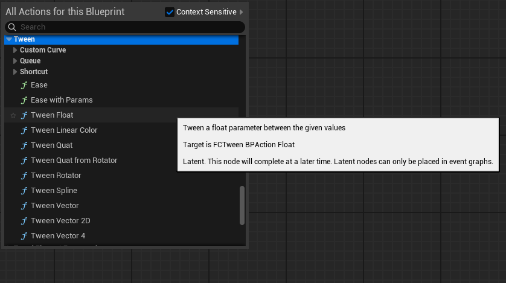

Give it a start and end value, and hook up the Apply Easing pin to your update logic. The Value pin gives you the current value each frame. Here is an example of how to move an actor up 50 units:


Which looks like this:

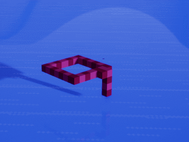

Here is one that does an infinite bobbing animation:

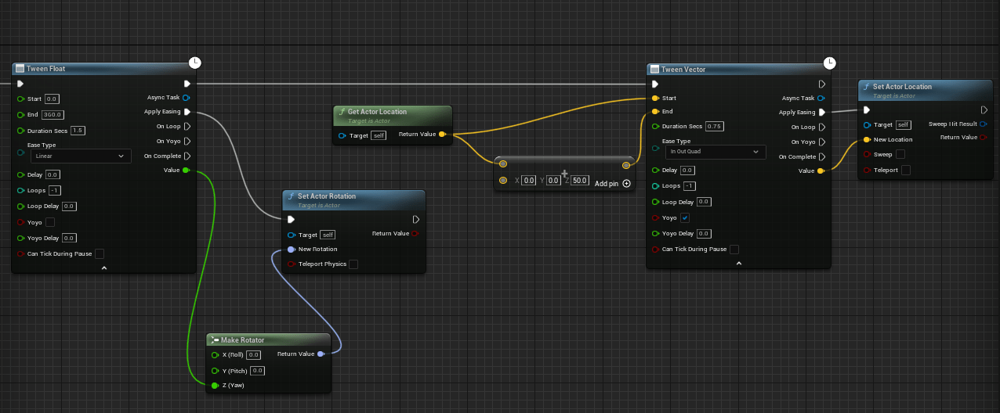

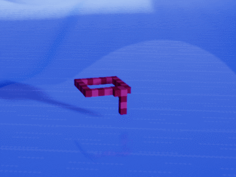

If you need to do something with the created tween later on, such as stopping it after an interaction, you can use the Async Task pin to operate on the tween.

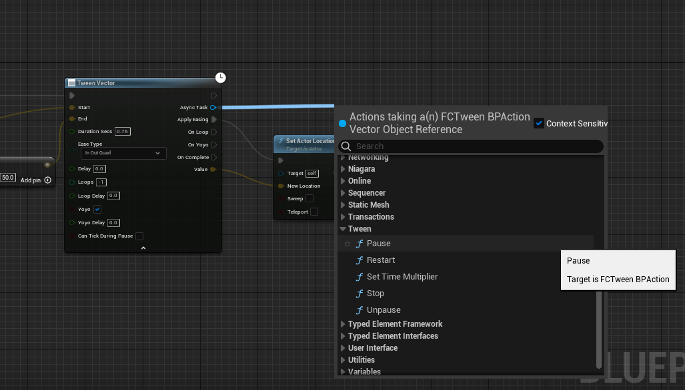

## Custom Curve

Use one of the versions under "Tweens/Custom Curve" to provide a UE curve as the easing function. These work best with a curve that goes from t=0 to t=1, and then adjust the duration in the tween, for design flexibility.

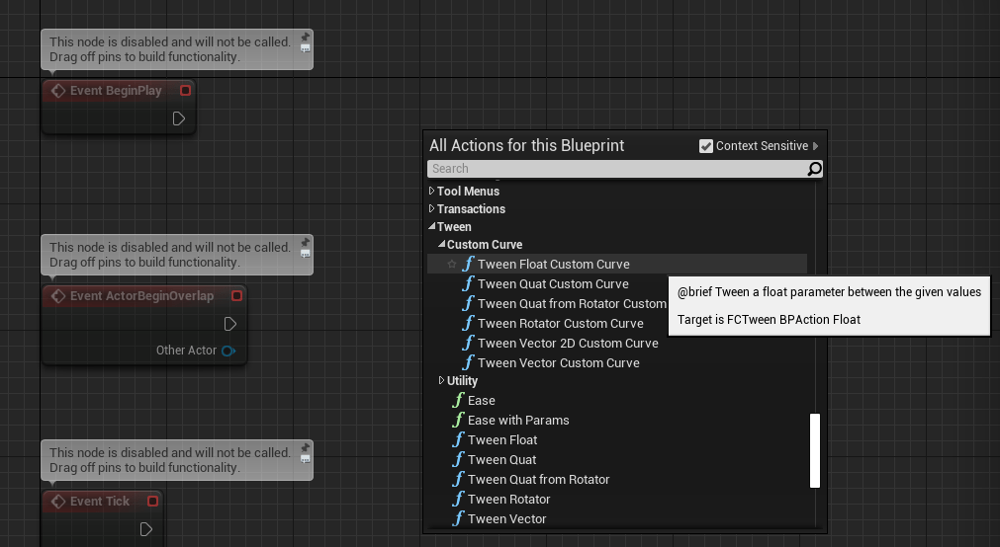

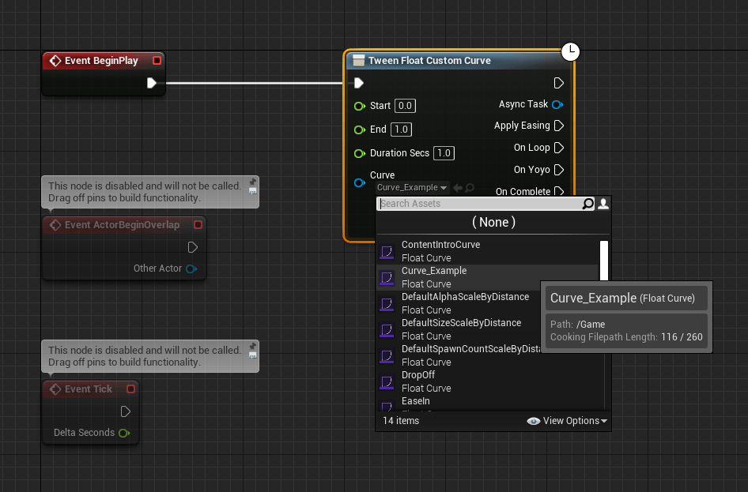

## Shortcuts
There are shortcuts available for Splines, Actors, Components, Materials, and Widgets.

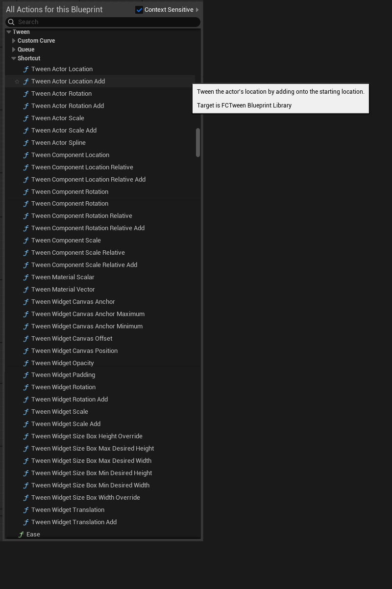

You can easily make an actor follow a spline with the TweenActorSpline shortcut:

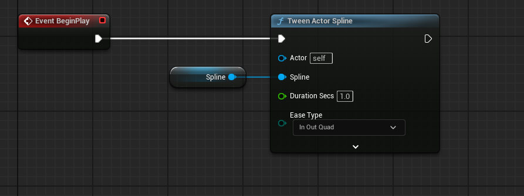

Or use TweenSpline to get the transform values along the given spline:

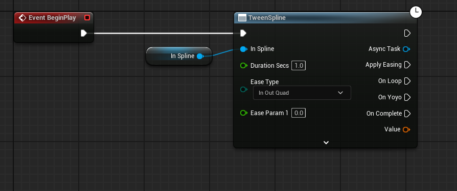

## TweenQueues
Use CreateTweenQueue to queue up multiple tweens one after the other. You can also add Delays and Callbacks.

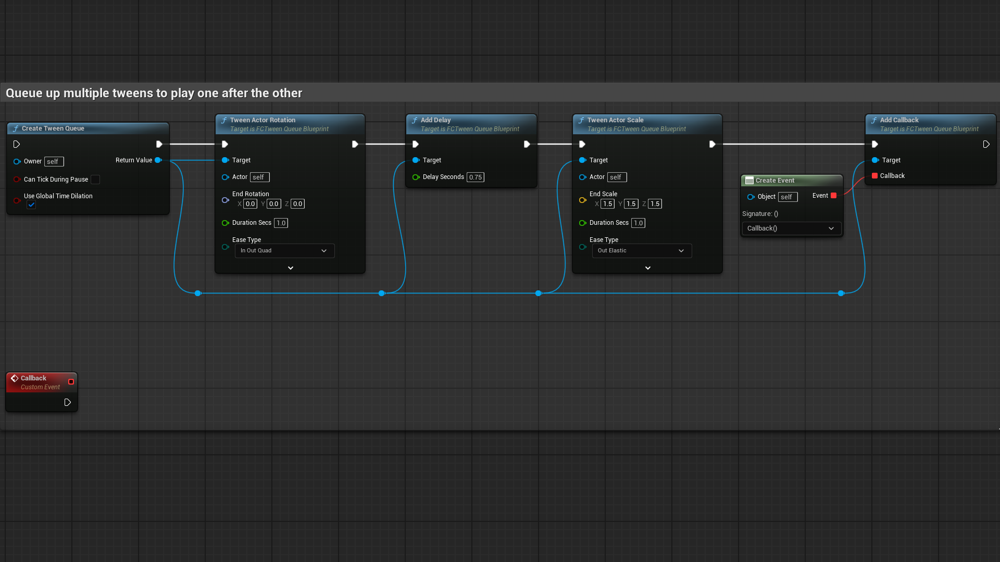

Make sure to drag off of the queue pin to use the **Queue** version of each tween. Otherwise the tween will play instantly instead of being added to the queue.

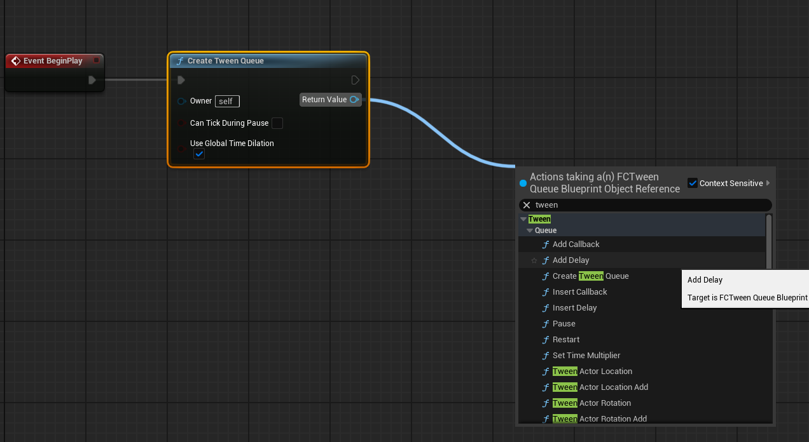

TweenQueues can also be used just for the delays and callbacks, for an alternative to the built in Delay nodes.

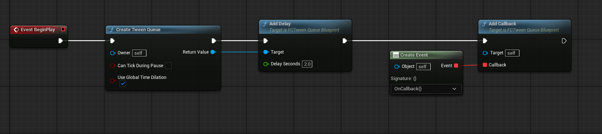

For Queues, the generic tweens like TweenFloat take a delegate. Right click on the delegate pin (in 5.5) to quickly generate a CreateEvent node. Or just put a custom event right next to the node.

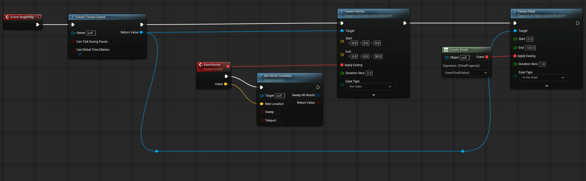

## Ease

Ease a 0-1 float with the given easing function. This is similar to UE's default Ease node, but it has all the FCTween easing functions available.

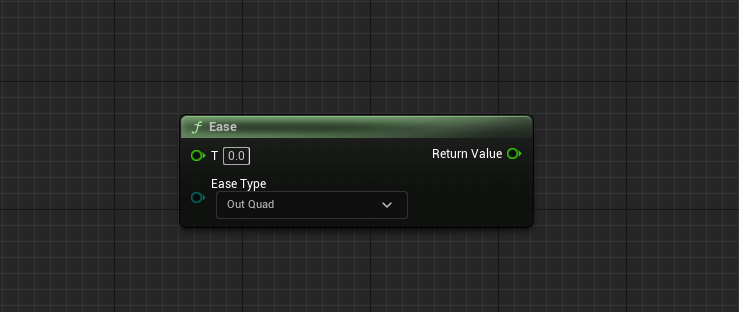

## Ease with Params

Same as ease, but you can override the baked in parameters for Elastic, Bounce, Back, and Smoothstep. 0 means no override provided. Default values are listed in the comments, if you hover over the param.

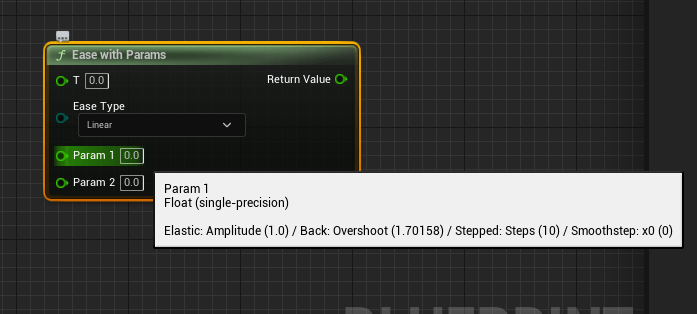


<a name="cppsection"></a>
# C++

- To use the C++ API, add FCTween as a dependency in your Build.cs:
```c#
PublicDependencyModuleNames.AddRange(new[] {"FCTween"});
```

## Basic Usage

- You can tween these types:
  - Float
  - Vector2D
  - Vector
  - Vector4
  - Quaternion
- Pass a lambda expression to FCTween::Play() for the update functionality.

Basic example:
```c++
FCTween::Play(0, 1, [this](float t) { TweenedFloat = t; }, .5f);
```
- Use `FCTween::PlayVector4` for FVector4 specifically, because of ambiguity with FVector.

With options:
```c++
FCTween::Play(0, 1, [this](float t) { TweenedFloat = t; }, .5f, EFCEase::OutElastic)
    ->SetLoops(2)
    ->SetYoyo(true)
    ->SetOnLoop([this]() { /* on loop functionality */ });
```

The start or end values can also be dynamic by passing in lambdas:
```c++
FCTween::Play(
  [this]()
  {
    return GetWorld()->TimeSeconds;
  },
  [this]()
  {
    return GetWorld()->TimeSeconds + 1;
  },
  [this](float t)
  {
    TweenedFloat2 = t;
  },
  .5f);
```
- Call `UseDynamicValuesOnlyOnce()` on the tween to only recalculate the dynamic values on the first update. Useful for adding a tween to a queue, where you want it to recalculate only once when the queue reaches it.


**Tip:** If you need to tween a type not covered by the API, use a float tween that goes from 0-1 and do the interpolation manually in the update, using the float as the percent.
```c++
FCTween::Play(0, 1, [this](float t)
{
    TweenedTransform = UKismetMathLibrary::TLerp(StartTransform, EndTransform, t);
}, 2.0f);
```

## Memory Safety
When using a generic tween, use `BindTo()` to make it safely check a weak pointer before executing each update. It will destroy itself when the object is garbage collected.
- If AutoDestroy is set to false, the tween will pause itself instead of calling Destroy.

```c++
FCTween::Play(0, 1, [this](float t){ TweenedFloat = t; }, 2.0f)
    ->BindTo(this);// make this tween memory-safe
```

Another option is to make the lambda itself safe, if that works better for a some use cases:
```c++
FCTween::Play(
    GetActorLocation(), GetActorLocation() + FVector(0, 0, 50),
    [this, WeakThis = MakeWeakObjectPtr(this)](FVector t)
    {
        if (WeakThis.IsValid())
        {
            SetActorLocation(t);
        }
    },
    2);
```

FCTween's blueprint nodes are **already memory-safe**. C++ shortcut functions like `PlayRotation()` are **already memory-safe** as well. No need to call BindTo() on them.

## Using a custom curve

There are blueprint shortcuts set up to take curves, but to do this in C++, you'll need to add a couple extra lines to set up the curve interpolation manually:
```c++
UPROPERTY(EditAnywhere)
UCurveFloat* CustomCurve;

FVector Start = FVector::ZeroVector;
FVector End = FVector(0, 0, 150);

FCTween::Play(
    0, 1,
    [this](float t)
    {
        float EasedFloat = CustomCurve->GetFloatValue(t);
        FVector EasedVector = FMath::Lerp(Start, End, EasedFloat);
        SetActorLocation(OriginalPos + EasedVector);
    },
    10.0f, EFCEase::Linear);
```

## Shortcuts
FCTween has shortcut functions for **Splines**, **Actor** transforms, **Component** transforms, **Material** scalars and vectors, and various **Widget** properties. These will safely use a weak pointer to the given target.

Examples:

```c++
// Tween "this" from its starting location to the given absolute location. 
// Make it loop infinitely with yoyo.
FCTween::PlayActorLocation(this, FVector(100), 1)
    ->SetLoops(-1)
    ->SetYoyo(true);
    
// Tween "this" by **adding** FVector(100) to its starting location
FCTween::PlayActorLocationAdd(this, FVector(100), 1);

// Tween Component by **adding** FVector(300) onto its starting **relative** location
FCTween::PlayComponentLocationRelativeAdd(Component, FVector(300), 1);

// Create a dynamic material instance, then tween its "testScalar" value from 0 to 100
UMaterialInterface* OriginalMaterial = Mesh->GetMaterial(0);
UMaterialInstanceDynamic* DynamicMaterial = UMaterialInstanceDynamic::Create(OriginalMaterial, this);
Mesh->SetMaterial(0, DynamicMaterial);
FCTween::PlayMaterialScalar(DynamicMaterial, "testScalar", 0, 100, 2);

// Tween the given widget's padding from 0 to 100.
// Automatically checks for these slot classes in this order: UOverlaySlot, UVerticalBoxSlot, 
// UHorizontalBoxSlot, USizeBoxSlot, UBorderSlot, UScrollBoxSlot, UButtonSlot
FCTween::PlayWidgetPadding(Widget, FVector4(0), FVector4(100, 100, 100, 100), 1);
```
These will calculate their starting values on their first update. So adding a bunch of `PlayActorLocationAdd()` calls in a row to a TweenQueue will make each tween correctly add to the last tween's end location.

## Tween Queues
You can queue up multiple tweens to be played one after the other. The queue itself can be bound to an object for safety, making any contained tweens or callbacks also safe.

You don't need to hold on to the queue's pointer unless you want to manually pause or stop it. It will operate like the tweens and auto-recycle itself.

You can add Delays and Callbacks to the queue as well. You could also use a queue just for the delays and callbacks for general use.

```c++
FCTweenQueue* Queue = FCTween::CreateQueue()
    ->BindTo(this);

Queue->AddTween(FCTween::Play(
    0, 1,
    [this](float t)
    {
        TweenedFloat = t;
    },
    .5f));

Queue->AddCallback(
    [this]()
    {
        UE_LOG(LogTemp, Warning, TEXT("Callback 1"));
    });

Queue->AddDelay(.5f);

Queue->AddTween(FCTween::PlayActorRotationAdd(this, FQuat::MakeFromEuler(FVector(25, 45, 90)), 2.3, EFCEase::InOutQuad));
Queue->AddTween(FCTween::PlayActorScaleAdd(this, FVector(1.5f, 0, 0), 2.3));
Queue->AddTween(FCTween::PlayComponentLocationRelativeAdd(Component, FVector(750, 0, 0), 2.3));
Queue->AddTween(FCTween::PlayComponentScaleRelativeAdd(Component, FVector(1.5f, 0, 0), 2.3));
Queue->AddTween(FCTween::PlayComponentRotationRelativeAdd(Component, FQuat::MakeFromEuler(FVector(25, 45, 90)), 2.3));
Queue->AddDelay(.5f);

Queue->AddCallback(
    [this]()
    {
        UE_LOG(LogTemp, Warning, TEXT("Callback 2"));
    });


```

## Tween Pointers

- Tweens will get recycled when they are finished. Do not keep a pointer to a recycled tween. To prevent recycling:
  - `Tween->SetAutoDestroy(false)` will prevent the auto-recycling, so you can restart or destroy the tween yourself. Make sure to destroy the tween when finished with it so it can be recycled.
  - `->SetLoops(-1)` will make the tween loop infinitely. You can pause, unpause, or restart if needed. You can use BindTo() with this option to make the tween auto-recycle itself when the owning object is destroyed.

`SetAutoDestroy(false)` example:
```c++
// Raw pointer, not a UObject
FCTweenInstance* Tween = nullptr;

virtual void BeginPlay() override
{
    Super::BeginPlay();

    // Infinitely looping vector tween. This will crash if it keeps going after this actor is destroyed. 
    Tween = FCTween::Play(FVector(0), FVector(1), [this](FVector t) { SetActorLocation(t); }, 5)
        ->SetAutoDestroy(false);
}

void TogglePause()
{
    if (Tween->bIsPaused)
    {
        Tween->Unpause();
    }
    else
    {
        Tween->Pause();
    }
}

virtual void EndPlay(const EEndPlayReason::Type EndPlayReason) override
{
    if (Tween != nullptr)
    {
        // This tells FCTween to recycle this tween
        Tween->Destroy();
        Tween = nullptr;
    }

    Super::EndPlay(EndPlayReason);
}
```

## Manual Memory Management

If you have a case that requires managing the tween's lifecycle manually, you can allocate the memory for a tween and update it manually like so:
```c++
// This will be cleaned up automatically when the actor is destroyed, because it's a shared pointer
TSharedPtr<FCTweenInstanceVector> ManualTween;

virtual void BeginPlay() override
{
    Super::BeginPlay();

    ManualTween = MakeShared<FCTweenInstanceVector>();
    // Make sure to call Initialize() when allocating manually.
    ManualTween->Initialize( 
        FVector::ZeroVector, FVector::OneVector, [this](FVector t) { SetActorLocation(t); }, .5f, EFCEase::OutQuad)
        ->SetLoops(-1);
}

virtual void Tick(float DeltaSeconds) override
{
    Super::Tick(DeltaSeconds);
    
    ManualTween->Update(DeltaSeconds, false);
}
```

<a name="easing-functions"></a>
# Easing Functions
Useful quick reference: https://easings.net/

| Available  | Functions  |              |     |
|------------|------------|--------------|-----|
| Linear     | InCubic    | InExpo       | InBounce    |
| Smoothstep | OutCubic   | OutExpo      | OutBounce   |
| Stepped    | InOutCubic | InOutExpo    | InOutBounce |
| InSine     | InQuart    | InCirc       | InBack      |
| OutSine    | OutQuart   | OutCirc      | OutBack     |
| InOutSine  | InOutQuart | InOutCirc    | InOutBack   |
| InQuad     | InQuint    | InElastic    |             |
| OutQuad    | OutQuint   | OutElastic   |             |
| InOutQuad  | InOutQuint | InOutElastic |             |

## In/Out explanation
Most functions have an In, Out, and InOut version. This indicates which end of the function the easing takes place.

"In" means the easing happens at the start:

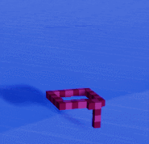

"Out" means the easing happens at the end:

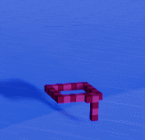

"InOut" means the easing happens at start and end:


## Examples

Linear
- It's just a lerp

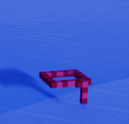

Sine
- Quad is usually preferred, since this one uses a Sine operation and is more expensive. But it's more gradual than Quad is, so it can be useful in places where you need the smoothest ease possible.

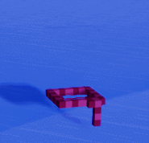

Quadratic
- The bread and butter - cheap formula (t * t) and looks good

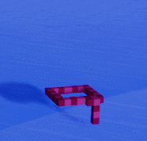

Cubic
- A more drastic Quadratic (t * t * t)


Quartic
- Even more drastic (t * t * t * t)

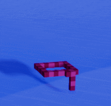

Quintic
- Veeeery drastic (t * t * t * t * t)

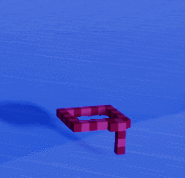

Exponential
- Like Quintic but even sharper

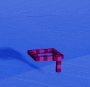

Circular
- The graph is a quarter circle. Makes it feel like the velocity changed suddenly. The start is faster than Quint but the end is slower than Quad. Use InCirc to be slow and then fast, instead

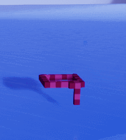

Smoothstep
- Pretty similar to InOutQuad

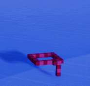

Stepped
- It's kind of like the opposite of easing, but here it is anyway
- Change EaseParam1 to set how many steps to use. It's set to 10 by default

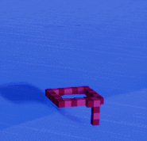

Elastic
- Cartoony "boing" effect. May take parameter tweaking to get it just how you want it in your game. Use EaseParam1 and EaseParam2 to tweak the amplitude and period. Looks good with scale, or menus transitioning on screen.
- EaseParam1 (Amplitude) is set to 1.0 by default. Raise it to make it wobble farther, lower it to make it smaller.
- EaseParam2 (Period) is set to 0.2 by default. Smaller is spazzier (more wave cycles in the same amount of time). Bigger means less cycles.


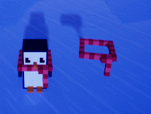

Bounce
- Bounces back from the target a couple of times

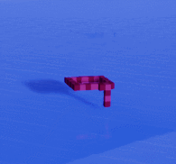

InBack
- Anticipation; pull back a little before going forward
- EaseParam1 (Overshoot) is set to 1.70158 by default. If you want to know why, here you go: [https://github.com/Michaelangel007/easing#the-magic-of-170158](https://github.com/Michaelangel007/easing#the-magic-of-170158)

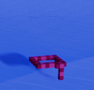

OutBack
- It overshoots the target and then pulls back to meet it. You can tweak the overshoot amount with EaseParam1.

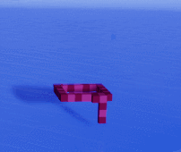

<a name="performance"></a>
# Performance

- FCTween uses a LinkedList to keep track of tweens, for fast adding/removal.
- Tweens are recycled to avoid unnecessary memory allocations.
- Small memory footprint, using C++ classes outside of the UObject ecosystem.
- Tweens are pre-allocated at GameInstance initialize, then allocated as needed. Use the FCTween Project Settings to set the initial capacity.
    - There are console warnings when you stop PIE to let you know when you could increase your initial capacity for performance.

<a name="references"></a>
# References
- http://robertpenner.com/easing/
  - The original easing functions.
- https://github.com/Michaelangel007/easing
  - Handier versions of those functions.
- https://github.com/photonstorm/phaser/tree/master/src/math/easing
  - The specific version of the Stepped and Elastic functions comes from Phaser.


<a name="api-reference"></a>
# API Reference

Static functions you can call in FCTween.h:
```c++

	/**
	 * Convenience function for FCEasing::Ease()
	 */
	static float Ease(float t, EFCEase EaseType);

	/**
	 * Play a float tween. Call BindTo() on the result to make it a weak lambda.
	 */
	static FCTweenInstanceFloat* Play(float Start, float End, TFunction<void(float)> OnUpdate, float DurationSecs, EFCEase EaseType = EFCEase::OutQuad);

	/**
	 * Play a float tween with dynamic values.
	 * Call BindTo() on the result to make it a weak lambda.
	 * Call UseDynamicValuesOnlyOnce() to recalculate values only on the first update (good for TweenQueues).
	 */
	static FCTweenInstanceFloat* Play(TFunction<float()> Start, TFunction<float()> End, TFunction<void(float)> OnUpdate, float DurationSecs, EFCEase EaseType = EFCEase::OutQuad);

	/**
	 * Play a float tween with a dynamic end value.
	 * Call BindTo() on the result to make it a weak lambda.
	 * Call UseDynamicValuesOnlyOnce() to recalculate values only on the first update (good for TweenQueues).
	 */
	static FCTweenInstanceFloat* Play(float Start, TFunction<float()> End, TFunction<void(float)> OnUpdate, float DurationSecs, EFCEase EaseType = EFCEase::OutQuad);

	/**
	 * Play a float tween with a dynamic start value.
	 * Call BindTo() on the result to make it a weak lambda.
	 * Call UseDynamicValuesOnlyOnce() to recalculate values only on the first update (good for TweenQueues).
	 */
	static FCTweenInstanceFloat* Play(TFunction<float()> Start, float End, TFunction<void(float)> OnUpdate, float DurationSecs, EFCEase EaseType = EFCEase::OutQuad);

	/**
	 * Play a vector2 tween. Call BindTo() on the result to make it a weak lambda (meaning memory-safe).
	 */
	static FCTweenInstanceVector2D* Play(FVector2D Start, FVector2D End, TFunction<void(FVector2D)> OnUpdate, float DurationSecs, EFCEase EaseType = EFCEase::OutQuad);

	/**
	 * Play a vector2 tween with dynamic values.
	 * Call BindTo() on the result to make it a weak lambda.
	 * Call UseDynamicValuesOnlyOnce() to recalculate values only on the first update (good for TweenQueues).
	 */
	static FCTweenInstanceVector2D* Play(
		TFunction<FVector2D()> Start, TFunction<FVector2D()> End, TFunction<void(FVector2D)> OnUpdate, float DurationSecs, EFCEase EaseType = EFCEase::OutQuad);

	/**
	 * Play a vector2 tween with a dynamic end value.
	 * Call BindTo() on the result to make it a weak lambda.
	 * Call UseDynamicValuesOnlyOnce() to recalculate values only on the first update (good for TweenQueues).
	 */
	static FCTweenInstanceVector2D* Play(FVector2D Start, TFunction<FVector2D()> End, TFunction<void(FVector2D)> OnUpdate, float DurationSecs, EFCEase EaseType = EFCEase::OutQuad);

	/**
	 * Play a vector2 tween with a dynamic start value.
	 * Call BindTo() on the result to make it a weak lambda.
	 * Call UseDynamicValuesOnlyOnce() to recalculate values only on the first update (good for TweenQueues).
	 */
	static FCTweenInstanceVector2D* Play(TFunction<FVector2D()> Start, FVector2D End, TFunction<void(FVector2D)> OnUpdate, float DurationSecs, EFCEase EaseType = EFCEase::OutQuad);

	/**
	 * Play a vector tween. Call BindTo() on the result to make it a weak lambda (meaning memory-safe).
	 */
	static FCTweenInstanceVector* Play(FVector Start, FVector End, TFunction<void(FVector)> OnUpdate, float DurationSecs, EFCEase EaseType = EFCEase::OutQuad);

	/**
	 * Play a vector tween with dynamic values.
	 * Call BindTo() on the result to make it a weak lambda.
	 * Call UseDynamicValuesOnlyOnce() to recalculate values only on the first update (good for TweenQueues).
	 */
	static FCTweenInstanceVector* Play(
		TFunction<FVector()> Start, TFunction<FVector()> End, TFunction<void(FVector)> OnUpdate, float DurationSecs, EFCEase EaseType = EFCEase::OutQuad);

	/**
	 * Play a vector tween with a dynamic end value.
	 * Call BindTo() on the result to make it a weak lambda.
	 * Call UseDynamicValuesOnlyOnce() to recalculate values only on the first update (good for TweenQueues).
	 */
	static FCTweenInstanceVector* Play(FVector Start, TFunction<FVector()> End, TFunction<void(FVector)> OnUpdate, float DurationSecs, EFCEase EaseType = EFCEase::OutQuad);

	/**
	 * Play a vector tween with a dynamic start value.
	 * Call BindTo() on the result to make it a weak lambda.
	 * Call UseDynamicValuesOnlyOnce() to recalculate values only on the first update (good for TweenQueues).
	 */
	static FCTweenInstanceVector* Play(TFunction<FVector()> Start, FVector End, TFunction<void(FVector)> OnUpdate, float DurationSecs, EFCEase EaseType = EFCEase::OutQuad);

	/**
	 * Play a vector4 tween. Call BindTo() on the result to make it a weak lambda (meaning memory-safe).
	 */
	static FCTweenInstanceVector4* PlayVector4(FVector4 Start, FVector4 End, TFunction<void(FVector4)> OnUpdate, float DurationSecs, EFCEase EaseType = EFCEase::OutQuad);

	/**
	 * Play a vector4 tween with dynamic values.
	 * Call BindTo() on the result to make it a weak lambda.
	 * Call UseDynamicValuesOnlyOnce() to recalculate values only on the first update (good for TweenQueues).
	 */
	static FCTweenInstanceVector4* PlayVector4(
		TFunction<FVector4()> Start, TFunction<FVector4()> End, TFunction<void(FVector4)> OnUpdate, float DurationSecs, EFCEase EaseType = EFCEase::OutQuad);

	/**
	 * Play a vector4 tween with a dynamic end value.
	 * Call BindTo() on the result to make it a weak lambda.
	 * Call UseDynamicValuesOnlyOnce() to recalculate values only on the first update (good for TweenQueues).
	 */
	static FCTweenInstanceVector4* PlayVector4(
		FVector4 Start, TFunction<FVector4()> End, TFunction<void(FVector4)> OnUpdate, float DurationSecs, EFCEase EaseType = EFCEase::OutQuad);

	/**
	 * Play a vector4 tween with a dynamic start value.
	 * Call BindTo() on the result to make it a weak lambda.
	 * Call UseDynamicValuesOnlyOnce() to recalculate values only on the first update (good for TweenQueues).
	 */
	static FCTweenInstanceVector4* PlayVector4(
		TFunction<FVector4()> Start, FVector4 End, TFunction<void(FVector4)> OnUpdate, float DurationSecs, EFCEase EaseType = EFCEase::OutQuad);

	/**
	 * Play a quaternion tween. Call BindTo() on the result to make it a weak lambda (meaning memory-safe).
	 */
	static FCTweenInstanceQuat* Play(FQuat Start, FQuat End, TFunction<void(FQuat)> OnUpdate, float DurationSecs, EFCEase EaseType = EFCEase::OutQuad);

	/**
	 * Play a quaternion tween with dynamic values.
	 * Call BindTo() on the result to make it a weak lambda.
	 * Call UseDynamicValuesOnlyOnce() to recalculate values only on the first update (good for TweenQueues).
	 */
	static FCTweenInstanceQuat* Play(TFunction<FQuat()> Start, TFunction<FQuat()> End, TFunction<void(FQuat)> OnUpdate, float DurationSecs, EFCEase EaseType = EFCEase::OutQuad);

	/**
	 * Play a quaternion tween with a dynamic end value.
	 * Call BindTo() on the result to make it a weak lambda.
	 * Call UseDynamicValuesOnlyOnce() to recalculate values only on the first update (good for TweenQueues).
	 */
	static FCTweenInstanceQuat* Play(FQuat Start, TFunction<FQuat()> End, TFunction<void(FQuat)> OnUpdate, float DurationSecs, EFCEase EaseType = EFCEase::OutQuad);

	/**
	 * Play a quaternion tween with a dynamic start value.
	 * Call BindTo() on the result to make it a weak lambda.
	 * Call UseDynamicValuesOnlyOnce() to recalculate values only on the first update (good for TweenQueues).
	 */
	static FCTweenInstanceQuat* Play(TFunction<FQuat()> Start, FQuat End, TFunction<void(FQuat)> OnUpdate, float DurationSecs, EFCEase EaseType = EFCEase::OutQuad);

	/**
	 * Shortcut to play a Color tween, utilizing FLinearColor::LerpUsingHSV(). Uses a float tween to accomplish this.
	 * Call BindTo() on the result to make it a weak lambda (meaning memory-safe).
	 */
	static FCTweenInstanceFloat* Play(FLinearColor Start, FLinearColor End, TFunction<void(FLinearColor)> OnUpdate, float DurationSecs, EFCEase EaseType = EFCEase::OutQuad);

	static FCTweenQueue* CreateQueue();

	/**
	 * Tween a spline, returning the transform at that point every update.
	 * This tween safely uses a weak pointer to the Spline. Call BindTo() to ALSO make it a weak lambda with respect to whatever object you are moving.
	 */
	static FCTweenInstanceFloat* PlaySpline(USplineComponent* Spline, TFunction<void(FTransform)> OnUpdate, float DurationSecs, EFCEase EaseType = EFCEase::OutQuad);

	/**
	 * Tween an actor along a spline path from start to end over the given duration. Following spline rotation is optional.
	 * This is a memory-safe function; this tween will be destroyed when the actor is destroyed. This tween safely uses a weak pointer to the spline.
	 */
	static FCTweenInstanceFloat* PlayActorSpline(AActor* Actor, USplineComponent* Spline, float DurationSecs, EFCEase EaseType = EFCEase::OutQuad,
		bool bShouldUpdateRotation = true, bool bSweep = false, bool bTeleport = true);

	/**
	 * Tween the actor's location to the given location.
	 * This is a memory-safe function; this tween will be destroyed when the actor is destroyed.
	 * @param Actor Actor to be moved
	 * @param EndLocation World location
	 */
	static FCTweenInstanceVector* PlayActorLocation(
		AActor* Actor, FVector EndLocation, float DurationSecs, EFCEase EaseType = EFCEase::OutQuad, bool bSweep = false, bool bTeleport = true);

	/**
	 * Tween the actor's location by adding onto the starting location.
	 * This is a memory-safe function; this tween will be destroyed when the actor is destroyed.
	 * @param Actor Actor to be moved
	 * @param AddedEndLocation Added onto the starting location
	 */
	static FCTweenInstanceVector* PlayActorLocationAdd(
		AActor* Actor, FVector AddedEndLocation, float DurationSecs, EFCEase EaseType = EFCEase::OutQuad, bool bSweep = false, bool bTeleport = true);

	/**
	 * Tween the actor's rotation to the given rotation.
	 * This is a memory-safe function; this tween will be destroyed when the actor is destroyed.
	 * @param Actor Actor to be rotated
	 * @param EndRotation World rotation
	 */
	static FCTweenInstanceQuat* PlayActorRotation(AActor* Actor, FQuat EndRotation, float DurationSecs, EFCEase EaseType = EFCEase::OutQuad, bool bTeleport = true);

	/**
	 * Tween the actor's rotation by adding onto the starting rotation.
	 * This is a memory-safe function; this tween will be destroyed when the actor is destroyed.
	 * @param Actor Actor to be rotated
	 * @param AddedEndRotation Added onto the starting rotation
	 */
	static FCTweenInstanceQuat* PlayActorRotationAdd(AActor* Actor, FQuat AddedEndRotation, float DurationSecs, EFCEase EaseType = EFCEase::OutQuad, bool bTeleport = true);

	/**
	 * Tween the actor's scale3D to the given scale.
	 * This is a memory-safe function; this tween will be destroyed when the actor is destroyed.
	 * @param Actor Actor to be rotated
	 * @param EndScale World scale
	 */
	static FCTweenInstanceVector* PlayActorScale(AActor* Actor, FVector EndScale, float DurationSecs, EFCEase EaseType = EFCEase::OutQuad);

	/**
	 * Tween the actor's scale3D by adding onto the starting scale.
	 * This is a memory-safe function; this tween will be destroyed when the actor is destroyed.
	 * @param Actor Actor to be rotated
	 * @param AddedEndScale Added onto the starting scale
	 */
	static FCTweenInstanceVector* PlayActorScaleAdd(AActor* Actor, FVector AddedEndScale, float DurationSecs, EFCEase EaseType = EFCEase::OutQuad);

	/**
	 * Tween the component's location to the given world location.
	 * This is a memory-safe function; this tween will be destroyed when the component is destroyed.
	 * @param Component Component to be moved
	 * @param EndLocation World location
	 */
	static FCTweenInstanceVector* PlayComponentLocation(
		USceneComponent* Component, FVector EndLocation, float DurationSecs, EFCEase EaseType = EFCEase::OutQuad, bool bSweep = false, bool bTeleport = true);

	/**
	 * Tween the component's location to the given relative location.
	 * This is a memory-safe function; this tween will be destroyed when the component is destroyed.
	 * @param Component Component to be moved
	 * @param RelativeEndLocation Location relative to parent component
	 */
	static FCTweenInstanceVector* PlayComponentLocationRelative(
		USceneComponent* Component, FVector RelativeEndLocation, float DurationSecs, EFCEase EaseType = EFCEase::OutQuad, bool bSweep = false, bool bTeleport = true);

	/**
	 * Tween the component's location by adding onto the starting relative location.
	 * This is a memory-safe function; this tween will be destroyed when the component is destroyed.
	 * @param Component Component to be moved
	 * @param AddedRelativeEndLocation Added onto the starting relative location
	 */
	static FCTweenInstanceVector* PlayComponentLocationRelativeAdd(
		USceneComponent* Component, FVector AddedRelativeEndLocation, float DurationSecs, EFCEase EaseType = EFCEase::OutQuad, bool bSweep = false, bool bTeleport = true);

	/**
	 * Tween the component's rotation to the given world rotation.
	 * This is a memory-safe function; this tween will be destroyed when the component is destroyed.
	 * @param Component Component to be rotated
	 * @param EndRotation World rotation
	 */
	static FCTweenInstanceQuat* PlayComponentRotation(
		USceneComponent* Component, FQuat EndRotation, float DurationSecs, EFCEase EaseType = EFCEase::OutQuad, bool bSweep = false, bool bTeleport = true);

	/**
	 * Tween the component's rotation to the given relative rotation.
	 * This is a memory-safe function; this tween will be destroyed when the component is destroyed.
	 * @param Component Component to be rotated
	 * @param RelativeEndRotation Relative rotation
	 */
	static FCTweenInstanceQuat* PlayComponentRotationRelative(
		USceneComponent* Component, FQuat RelativeEndRotation, float DurationSecs, EFCEase EaseType = EFCEase::OutQuad, bool bSweep = false, bool bTeleport = true);

	/**
	 * Tween the component's rotation by adding onto the starting relative rotation.
	 * This is a memory-safe function; this tween will be destroyed when the component is destroyed.
	 * @param Component Component to be rotated
	 * @param AddedRelativeEndRotation Added onto the starting relative rotation
	 */
	static FCTweenInstanceQuat* PlayComponentRotationRelativeAdd(
		USceneComponent* Component, FQuat AddedRelativeEndRotation, float DurationSecs, EFCEase EaseType = EFCEase::OutQuad, bool bSweep = false, bool bTeleport = true);

	/**
	 * Tween the component's scale to the given world scale.
	 * This is a memory-safe function; this tween will be destroyed when the component is destroyed.
	 * @param Component Component to be scaled
	 * @param EndScale World scale
	 */
	static FCTweenInstanceVector* PlayComponentScale(USceneComponent* Component, FVector EndScale, float DurationSecs, EFCEase EaseType = EFCEase::OutQuad);

	/**
	 * Tween the component's scale to the given relative scale.
	 * This is a memory-safe function; this tween will be destroyed when the component is destroyed.
	 * @param Component Component to be scaled
	 * @param RelativeEndScale Relative scale
	 */
	static FCTweenInstanceVector* PlayComponentScaleRelative(USceneComponent* Component, FVector RelativeEndScale, float DurationSecs, EFCEase EaseType = EFCEase::OutQuad);

	/**
	 * Tween the component's scale by adding onto the starting relative scale.
	 * This is a memory-safe function; this tween will be destroyed when the component is destroyed.
	 * @param Component Component to be scaled
	 * @param AddedRelativeEndScale Added onto relative scale
	 */
	static FCTweenInstanceVector* PlayComponentScaleRelativeAdd(USceneComponent* Component, FVector AddedRelativeEndScale, float DurationSecs, EFCEase EaseType = EFCEase::OutQuad);

	/**
	 * This is a memory-safe function; this tween will be destroyed when the material is destroyed.
	 */
	static FCTweenInstanceFloat* PlayMaterialScalar(
		UMaterialInstanceDynamic* Material, FName ParameterName, float Start, float End, float DurationSecs, EFCEase EaseType = EFCEase::OutQuad);

	/**
	 * This is a memory-safe function; this tween will be destroyed when the material is destroyed.
	 */
	static FCTweenInstanceFloat* PlayMaterialScalarIndex(
		UMaterialInstanceDynamic* Material, int32 ParameterIndex, float Start, float End, float DurationSecs, EFCEase EaseType = EFCEase::OutQuad);

	/**
	 * This is a memory-safe function; this tween will be destroyed when the material is destroyed.
	 */
	static FCTweenInstanceFloat* PlayMaterialVector(
		UMaterialInstanceDynamic* Material, FName ParameterName, FLinearColor Start, FLinearColor End, float DurationSecs, EFCEase EaseType = EFCEase::OutQuad);

	/**
	 * This is a memory-safe function; this tween will be destroyed when the material is destroyed.
	 */
	static FCTweenInstanceFloat* PlayMaterialVectorIndex(
		UMaterialInstanceDynamic* Material, int32 ParameterIndex, FLinearColor Start, FLinearColor End, float DurationSecs, EFCEase EaseType = EFCEase::OutQuad);

	/**
	 * This is a memory-safe function; this tween will be destroyed when the widget is destroyed.
	 * @param Widget Widget to be scaled
	 */
	static FCTweenInstanceVector2D* PlayWidgetTranslation(
		UWidget* Widget, FVector2D StartTranslation, FVector2D EndTranslation, float DurationSecs, EFCEase EaseType = EFCEase::OutQuad);

	/**
	 * Tween the widget's render translation by adding onto the starting translation.
	 * This is a memory-safe function; this tween will be destroyed when the widget is destroyed.
	 * @param Widget Widget to be translated
	 * @param AddedEndTranslation Added onto starting translation
	 */
	static FCTweenInstanceVector2D* PlayWidgetTranslationAdd(UWidget* Widget, FVector2D AddedEndTranslation, float DurationSecs, EFCEase EaseType = EFCEase::OutQuad);

	/**
	 * This is a memory-safe function; this tween will be destroyed when the widget is destroyed.
	 * @param Widget Widget to be scaled
	 */
	static FCTweenInstanceVector2D* PlayWidgetScale(UWidget* Widget, FVector2D StartScale, FVector2D EndScale, float DurationSecs, EFCEase EaseType = EFCEase::OutQuad);

	/**
	 * This is a memory-safe function; this tween will be destroyed when the widget is destroyed.
	 * @param Widget Widget to be scaled
	 * @param AddedEndScale Added onto starting scale
	 */
	static FCTweenInstanceVector2D* PlayWidgetScaleAdd(UWidget* Widget, FVector2D AddedEndScale, float DurationSecs, EFCEase EaseType = EFCEase::OutQuad);

	/**
	 * This is a memory-safe function; this tween will be destroyed when the widget is destroyed.
	 * @param Widget Widget to be rotated
	 */
	static FCTweenInstanceFloat* PlayWidgetRotation(UWidget* Widget, float StartAngle, float EndAngle, float DurationSecs, EFCEase EaseType = EFCEase::OutQuad);

	/**
	 * Tween the widget's render rotation by adding onto the starting rotation.
	 * This is a memory-safe function; this tween will be destroyed when the widget is destroyed.
	 * @param Widget Widget to be rotated
	 * @param AddedEndAngle Added onto starting rotation
	 */
	static FCTweenInstanceFloat* PlayWidgetRotationAdd(UWidget* Widget, float AddedEndAngle, float DurationSecs, EFCEase EaseType = EFCEase::OutQuad);

	/**
	 * This is a memory-safe function; this tween will be destroyed when the widget is destroyed.
	 * @param Widget Widget to be rotated
	 */
	static FCTweenInstanceFloat* PlayWidgetOpacity(UWidget* Widget, float StartOpacity, float EndOpacity, float DurationSecs, EFCEase EaseType = EFCEase::OutQuad);

	/**
	 * Tweens the widget's padding. Automatically gets the correct slot type by attempting to cast.
	 * Checks for these slot classes in this order: UOverlaySlot, UVerticalBoxSlot, UHorizontalBoxSlot, USizeBoxSlot, UBorderSlot, UScrollBoxSlot, UButtonSlot
	 * This is a memory-safe function; this tween will be destroyed when the widget is destroyed.
	 */
	static FCTweenInstanceVector4* PlayWidgetPadding(UWidget* Widget, FVector4 StartPadding, FVector4 EndPadding, float DurationSecs, EFCEase EaseType = EFCEase::OutQuad);

	/**
	 * This is a memory-safe function; this tween will be destroyed when the widget is destroyed.
	 */
	static FCTweenInstanceVector4* PlayWidgetCanvasOffset(UWidget* Widget, FVector4 StartOffsets, FVector4 EndOffsets, float DurationSecs, EFCEase EaseType = EFCEase::OutQuad);

	/**
	 * This is a memory-safe function; this tween will be destroyed when the widget is destroyed.
	 */
	static FCTweenInstanceVector4* PlayWidgetCanvasAnchor(UWidget* Widget, FVector4 StartAnchors, FVector4 EndAnchors, float DurationSecs, EFCEase EaseType = EFCEase::OutQuad);

	/**
	 * This is a memory-safe function; this tween will be destroyed when the widget is destroyed.
	 */
	static FCTweenInstanceVector2D* PlayWidgetCanvasAnchorMinimum(
		UWidget* Widget, FVector2D StartAnchor, FVector2D EndAnchor, float DurationSecs, EFCEase EaseType = EFCEase::OutQuad);

	/**
	 * This is a memory-safe function; this tween will be destroyed when the widget is destroyed.
	 */
	static FCTweenInstanceVector2D* PlayWidgetCanvasAnchorMaximum(
		UWidget* Widget, FVector2D StartAnchor, FVector2D EndAnchor, float DurationSecs, EFCEase EaseType = EFCEase::OutQuad);

	/**
	 * Tweens the X and Y of the canvas slot offsets.
	 * This is a memory-safe function; this tween will be destroyed when the widget is destroyed.
	 */
	static FCTweenInstanceVector2D* PlayWidgetCanvasPosition(
		UWidget* Widget, FVector2D StartPosition, FVector2D EndPosition, float DurationSecs, EFCEase EaseType = EFCEase::OutQuad);

	/**
	 * This is a memory-safe function; this tween will be destroyed when the widget is destroyed.
	 */
	static FCTweenInstanceFloat* PlayWidgetSizeBoxWidthOverride(USizeBox* Widget, float Start, float End, float DurationSecs, EFCEase EaseType = EFCEase::OutQuad);

	/**
	 * This is a memory-safe function; this tween will be destroyed when the widget is destroyed.
	 */
	static FCTweenInstanceFloat* PlayWidgetSizeBoxHeightOverride(USizeBox* Widget, float Start, float End, float DurationSecs, EFCEase EaseType = EFCEase::OutQuad);

	/**
	 * This is a memory-safe function; this tween will be destroyed when the widget is destroyed.
	 */
	static FCTweenInstanceFloat* PlayWidgetSizeBoxMinDesiredWidth(USizeBox* Widget, float Start, float End, float DurationSecs, EFCEase EaseType = EFCEase::OutQuad);

	/**
	 * This is a memory-safe function; this tween will be destroyed when the widget is destroyed.
	 */
	static FCTweenInstanceFloat* PlayWidgetSizeBoxMaxDesiredWidth(USizeBox* Widget, float Start, float End, float DurationSecs, EFCEase EaseType = EFCEase::OutQuad);

	/**
	 * This is a memory-safe function; this tween will be destroyed when the widget is destroyed.
	 */
	static FCTweenInstanceFloat* PlayWidgetSizeBoxMinDesiredHeight(USizeBox* Widget, float Start, float End, float DurationSecs, EFCEase EaseType = EFCEase::OutQuad);

	/**
	 * This is a memory-safe function; this tween will be destroyed when the widget is destroyed.
	 */
	static FCTweenInstanceFloat* PlayWidgetSizeBoxMaxDesiredHeight(USizeBox* Widget, float Start, float End, float DurationSecs, EFCEase EaseType = EFCEase::OutQuad);

```

FCTweenInstance options:
```c++

	FCTweenInstance* SetDelay(float InDelaySecs);

	/**
	 * How many times to replay the loop. A single loop includes the optional yoyo. Use -1 for infinity
	 */
	FCTweenInstance* SetLoops(int InNumLoops);

	/**
	 * seconds to wait before starting another loop
	 */
	FCTweenInstance* SetLoopDelay(float InLoopDelaySecs);

	/**
	 * interpolate backwards after reaching the end
	 */
	FCTweenInstance* SetYoyo(bool bInShouldYoyo);

	/**
	 * seconds to wait before yoyo-ing backwards
	 */
	FCTweenInstance* SetYoyoDelay(float InYoyoDelaySecs);

	/**
	 * multiply the time delta by this number to speed up or slow down the tween. Only positive numbers allowed.
	 */
	FCTweenInstance* SetTimeMultiplier(float InTimeMultiplier);

	/**
	 * set EaseParam1 to fine-tune specific equations. Elastic: Amplitude (1.0) / Back: Overshoot (1.70158) / Stepped: Steps
	 * (10) / Smoothstep: x0 (0)
	 */
	FCTweenInstance* SetEaseParam1(float InEaseParam1);

	/**
	 * set EaseParam2 to fine-tune specific equations. Elastic: Period (0.2) / Smoothstep: x1 (1)
	 */
	FCTweenInstance* SetEaseParam2(float InEaseParam2);

	/**
	 * let this tween run while the game is paused
	 */
	FCTweenInstance* SetCanTickDuringPause(bool bInCanTickDuringPause);

	/**
	 * let this tween run while the game is paused
	 */
	FCTweenInstance* SetUseGlobalTimeDilation(bool bInUseGlobalTimeDilation);

	/**
	 * Automatically recycles this instance after the tween is complete (or Stop() is called)
	 * Note: If you also use BindTo(), keep in mind that this tween won't continue executing if the bound object is invalid.
	 */
	FCTweenInstance* SetAutoDestroy(bool bInShouldAutoDestroy);

	/**
	 * Tell the tween to keep a weak pointer to the Object, and recycle itself if the Object is invalid.
	 *
	 * Note: If AutoDestroy is set to false, this tween will not be recycled until you manually call Destroy(). It will just pause itself when the object becomes invalid.
	 */
	FCTweenInstance* BindTo(UObject* Object);
	/**
	 * If there is a binding, checks its validity. If there is no binding, returns true by default.
	 */
	bool IsBindingValid();

	/**
	 * Recalculate start and end values with provided lambdas only once.
	 */
	FCTweenInstance* UseDynamicValuesOnlyOnce();
	/**
	 * Recalculate start value with provided lambda only once.
	 */
	FCTweenInstance* UseDynamicStartOnlyOnce();
	/**
	 * Recalculate end value with provided lambda only once.
	 */
	FCTweenInstance* UseDynamicEndOnlyOnce();

	/**
	 * This lambda will be called when the tween first begins, after the initial Delay timer. Called again if Restart() is triggered. Not called on loops.
	 */
	FCTweenInstance* SetOnStart(TFunction<void()> Handler);
	FCTweenInstance* SetOnYoyo(TFunction<void()> Handler);
	FCTweenInstance* SetOnLoop(TFunction<void()> Handler);
	FCTweenInstance* SetOnComplete(TFunction<void()> Handler);
	/**
	 * Takes the existing tween settings and restarts the timer, to play it again from the start
	 */
	void Restart();
	/**
	 * stop tweening and mark this instance for recycling
	 */
	void Destroy();
	void Pause();
	void Unpause();
```

FCTweenQueue options:
```c++

	/**
	 * Adds a tween to the end of the queue. It will be paused until the queue reaches it.
	 * Note: infinitely looping tweens will infinitely loop and prevent the queue from continuing.
	 */
	void AddTween(FCTweenInstance* Tween);
	/**
	 * Insert the tween at the given index.
	 */
	void Insert(FCTweenInstance* Tween, int Index);
	/**
	 * Runs the callback when it is reached. ex:
	 *
	 * Queue.AddCallback([this]()
	 * {
	 *		// run code here
	 * });
	 */
	void AddCallback(TFunction<void()> Callback);
	/**
	 * Insert the callback at the given index. ex:
	 *
	 * Queue.InsertCallback([this]()
	 * {
	 *		// run code here
	 * });
	 */
	void InsertCallback(TFunction<void()> Callback, int Index);
	/**
	 * Delays the next item in the queue.
	 */
	void AddDelay(float DelaySecs);
	/**
	 * Insert the delay at the given index.
	 */
	void InsertDelay(float DelaySecs, int Index);
	/**
	 * Set the time multiplier for all contained tweens and delays.
	 */
	FCTweenQueue* SetTimeMultiplier(float InTimeMultiplier);
	/**
	 * Set bInCanTickDuringPause for all contained tweens and delays.
	 */
	FCTweenQueue* SetCanTickDuringPause(bool bInCanTickDuringPause);
	/**
	 * Set bUseGlobalTimeDilation for all contained tweens and delays.
	 */
	FCTweenQueue* SetUseGlobalTimeDilation(bool bInUseGlobalTimeDilation);
	/**
	 * How many times to replay the queue. Use -1 for infinity.
	 */
	FCTweenQueue* SetLoops(int InNumLoops);
	/**
	 * Tell the queue to keep a weak pointer to the Object, and recycle itself if the Object is invalid.
	 *
	 * Note: If AutoDestroy is set to false, this queue will not be recycled until you manually call Destroy(). It will just pause itself when the object becomes invalid.
	 */
	FCTweenQueue* BindTo(UObject* Object);
	/**
	 * If there is a binding, checks its validity. If there is no binding, returns true by default.
	 */
	bool IsBindingValid();
	/**
	 * Tell this queue not to recycle itself when complete, so you can manually restart it at some point.
	 * Note: If you also use BindTo(), keep in mind that this queue won't continue executing if the bound object is invalid.
	 */
	FCTweenQueue* SetAutoDestroy(bool bInAutoDestroy);
	/**
	 * Set a callback for when the entire queue finishes executing.
	 */
	FCTweenQueue* SetOnQueueComplete(TFunction<void()> Callback);

	void Pause();
	void Unpause();
	void Restart();
	void Destroy();
```
