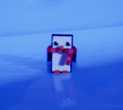

 

A tweening library for Unreal Engine, by [Jared Cook](https://twitter.com/FreshCookedDev).


### C++:

```c++
// Generic version
FCTween::Play(
    GetActorLocation(),
    GetActorLocation() + FVector(0, 0, 50),
    [this](FVector t)
    {
        SetActorLocation(t);
    },
    2.0f,
    EFCEase::OutCubic)
    ->BindTo(this); // BindTo() makes the lambda safe

// Shortcut version
FCTween::PlayActorLocationAdd(this, FVector(0, 0, 50), 2, EFCEase::OutCubic);
```

### Blueprints:


## Table of Contents
> 1. [Blueprints](#blueprintsection)
> 1. [C++](#cppsection)
> 1. [Easing Functions](#easing-functions)
> 1. [Performance](#performance)
> 1. [References](#references)

## Why Tweens?

Tweening libraries provide convenient curve functions to ease a value be***tween*** a start and end, like a position, scale, color, or anything you want to smoothly change. They are useful in small projects and large projects. Many polished UIs have some kind of tween operating.

It can be a large efficiency gain to let a programmer or designer quickly set up a tween with easily tunable values, instead of taking up the art department's precious time tweaking curves manually.

In big projects, they are great for those little polish items. Some small projects can find broader use for them:



```c++
WaddleRotator = GetMesh()->GetRelativeRotation();
WaddleTween = FCTween::Play(
    -WADDLE_ANGLE, WADDLE_ANGLE,
    [this](float t)
    {
        WaddleRotator.Pitch = t;
        GetMesh()->SetRelativeRotation(WaddleRotator);
    },
    WADDLE_SECS, EFCEase::InOutSine)
                  ->SetYoyo(true)
                  ->SetLoops(-1);
```

## Functionality already in Unreal Engine

It's good to know what is already available to you in-engine before installing other tools.
- [Timelines](https://docs.unrealengine.com/4.27/en-US/ProgrammingAndScripting/Blueprints/UserGuide/Timelines/)
  - Useful, but not as easy to tweak as tweens, or to set up in C++.
- `FMath::InterpEaseIn()`, `FMath::InterpEaseOut()`, `FMath::InterpEaseInOut()` provide ease functions for sin, expo, circular, smoothstep. They let you define your own exponent, which allows you to do quad, cubic, quart, or more.
- [Critically damped springs](https://www.alexisbacot.com/blog/the-art-of-damping)
  - Useful for a lot of things, especially cameras. Check out these functions if you haven't heard of that yet:

```c++
FMath::SpringDamper()
FMath::CriticallyDampedSmoothing()
UKismetMathLibrary::FloatSpringInterp()
UKismetMathLibrary::QuaternionSpringInterp()
```

<a name="blueprintsection"></a>
# Blueprints

## Basic Usage
Add a BP task from the "Tween" category.


Give it a start and end value, and hook up the Apply Easing pin to your update logic. The Value pin gives you the current value each frame. Here is an example of how to move an actor up 50 units:


Which looks like this:


Here is one that does an infinite bobbing animation:


If you need to do something with the created tween later on, such as stopping it after an interaction, you can use the Async Task pin to operate on the tween.


## Custom Curve

Use one of the versions under "Tweens/Custom Curve" to provide a UE curve as the easing function. These work best with a curve that goes from t=0 to t=1, and then adjust the duration in the tween, for design flexibility.


## Shortcuts
There are shortcuts available for Splines, Actors, Components, Materials, and Widgets.


You can easily make an actor follow a spline with the TweenActorSpline shortcut:


Or use TweenSpline to get the transform values along the given spline:


## TweenQueues
Use CreateTweenQueue to queue up multiple tweens one after the other. You can also add Delays and Callbacks.


Make sure to drag off of the queue pin to use the **Queue** version of each tween. Otherwise the tween will play instantly instead of being added to the queue.


TweenQueues can also be used just for the delays and callbacks, for an alternative to the built in Delay nodes.


For Queues, the generic tweens like TweenFloat take a delegate. Right click on the delegate pin (in 5.5) to quickly generate a CreateEvent node. Or just put a custom event right next to the node.


## Ease

Ease a 0-1 float with the given easing function. This is similar to UE's default Ease node, but it has all the FCTween easing functions available.


## Ease with Params

Same as ease, but you can override the baked in parameters for Elastic, Bounce, Back, and Smoothstep. 0 means no override provided. Default values are listed in the comments, if you hover over the param.


<a name="cppsection"></a>
# C++

- To use the C++ API, add FCTween as a dependency in your Build.cs:
```c#
PublicDependencyModuleNames.AddRange(new[] {"FCTween"});
```

## Basic Usage

- You can tween these types:
  - Float
  - Vector2D
  - Vector
  - Vector4
  - Quaternion
- Pass a lambda expression to FCTween::Play() for the update functionality.

Basic example:
```c++
FCTween::Play(0, 1, [this](float t) { TweenedFloat = t; }, .5f);
```
- Use `FCTween::PlayVector4` for FVector4 specifically, because of ambiguity with FVector.

With options:
```c++
FCTween::Play(0, 1, [this](float t) { TweenedFloat = t; }, .5f, EFCEase::OutElastic)
    ->SetLoops(2)
    ->SetYoyo(true)
    ->SetOnLoop([this]() { /* on loop functionality */ });
```

The start or end values can also be dynamic by passing in lambdas:
```c++
FCTween::Play(
  [this]()
  {
    return GetWorld()->TimeSeconds;
  },
  [this]()
  {
    return GetWorld()->TimeSeconds + 1;
  },
  [this](float t)
  {
    TweenedFloat2 = t;
  },
  .5f);
```
- Call `UseDynamicValuesOnlyOnce()` on the tween to only recalculate the dynamic values on the first update. Useful for adding a tween to a queue, where you want it to recalculate only once when the queue reaches it.


**Tip:** If you need to tween a type not covered by the API, use a float tween that goes from 0-1 and do the interpolation manually in the update, using the float as the percent.
```c++
FCTween::Play(0, 1, [this](float t)
{
    TweenedTransform = UKismetMathLibrary::TLerp(StartTransform, EndTransform, t);
}, 2.0f);
```

## Memory Safety
When using a generic tween, use `BindTo()` to make it safely check a weak pointer before executing each update. It will destroy itself when the object is garbage collected.
- If AutoDestroy is set to false, the tween will pause itself instead of calling Destroy.

```c++
FCTween::Play(0, 1, [this](float t){ TweenedFloat = t; }, 2.0f)
    ->BindTo(this);// make this tween memory-safe
```

Another option is to make the lambda itself safe, if that works better for a some use cases:
```c++
FCTween::Play(
    GetActorLocation(), GetActorLocation() + FVector(0, 0, 50),
    [this, WeakThis = MakeWeakObjectPtr(this)](FVector t)
    {
        if (WeakThis.IsValid())
        {
            SetActorLocation(t);
        }
    },
    2);
```

FCTween's blueprint nodes are **already memory-safe**. C++ shortcut functions like `PlayRotation()` are **already memory-safe** as well. No need to call BindTo() on them.

## Using a custom curve

There are blueprint shortcuts set up to take curves, but to do this in C++, you'll need to add a couple extra lines to set up the curve interpolation manually:
```c++
UPROPERTY(EditAnywhere)
UCurveFloat* CustomCurve;

FVector Start = FVector::ZeroVector;
FVector End = FVector(0, 0, 150);

FCTween::Play(
    0, 1,
    [this](float t)
    {
        float EasedFloat = CustomCurve->GetFloatValue(t);
        FVector EasedVector = FMath::Lerp(Start, End, EasedFloat);
        SetActorLocation(OriginalPos + EasedVector);
    },
    10.0f, EFCEase::Linear);
```

## Shortcuts
FCTween has shortcut functions for **Splines**, **Actor** transforms, **Component** transforms, **Material** scalars and vectors, and various **Widget** properties. These will safely use a weak pointer to the given target.

Examples:

```c++
// Tween "this" from its starting location to the given absolute location. 
// Make it loop infinitely with yoyo.
FCTween::PlayActorLocation(this, FVector(100), 1)
    ->SetLoops(-1)
    ->SetYoyo(true);
    
// Tween "this" by **adding** FVector(100) to its starting location
FCTween::PlayActorLocationAdd(this, FVector(100), 1);

// Tween Component by **adding** FVector(300) onto its starting **relative** location
FCTween::PlayComponentLocationRelativeAdd(Component, FVector(300), 1);

// Create a dynamic material instance, then tween its "testScalar" value from 0 to 100
UMaterialInterface* OriginalMaterial = Mesh->GetMaterial(0);
UMaterialInstanceDynamic* DynamicMaterial = UMaterialInstanceDynamic::Create(OriginalMaterial, this);
Mesh->SetMaterial(0, DynamicMaterial);
FCTween::PlayMaterialScalar(DynamicMaterial, "testScalar", 0, 100, 2);

// Tween the given widget's padding from 0 to 100.
// Automatically checks for these slot classes in this order: UOverlaySlot, UVerticalBoxSlot, 
// UHorizontalBoxSlot, USizeBoxSlot, UBorderSlot, UScrollBoxSlot, UButtonSlot
FCTween::PlayWidgetPadding(Widget, FVector4(0), FVector4(100, 100, 100, 100), 1);
```
These will calculate their starting values on their first update. So adding a bunch of `PlayActorLocationAdd()` calls in a row to a TweenQueue will make each tween correctly add to the last tween's end location.

## Tween Queues
You can queue up multiple tweens to be played one after the other. The queue itself can be bound to an object for safety, making any contained tweens or callbacks also safe.

You don't need to hold on to the queue's pointer unless you want to manually pause or stop it. It will operate like the tweens and auto-recycle itself.

You can add Delays and Callbacks to the queue as well. You could also use a queue just for the delays and callbacks for general use.

```c++
FCTweenQueue* Queue = FCTween::CreateQueue()
    ->BindTo(this);

Queue->AddTween(FCTween::Play(
    0, 1,
    [this](float t)
    {
        TweenedFloat = t;
    },
    .5f));

Queue->AddCallback(
    [this]()
    {
        UE_LOG(LogTemp, Warning, TEXT("Callback 1"));
    });

Queue->AddDelay(.5f);

Queue->AddTween(FCTween::PlayActorRotationAdd(this, FQuat::MakeFromEuler(FVector(25, 45, 90)), 2.3, EFCEase::InOutQuad));
Queue->AddTween(FCTween::PlayActorScaleAdd(this, FVector(1.5f, 0, 0), 2.3));
Queue->AddTween(FCTween::PlayComponentLocationRelativeAdd(Component, FVector(750, 0, 0), 2.3));
Queue->AddTween(FCTween::PlayComponentScaleRelativeAdd(Component, FVector(1.5f, 0, 0), 2.3));
Queue->AddTween(FCTween::PlayComponentRotationRelativeAdd(Component, FQuat::MakeFromEuler(FVector(25, 45, 90)), 2.3));
Queue->AddDelay(.5f);

Queue->AddCallback(
    [this]()
    {
        UE_LOG(LogTemp, Warning, TEXT("Callback 2"));
    });


```

## Tween Pointers

- Tweens will get recycled when they are finished. Do not keep a pointer to a recycled tween. To prevent recycling:
  - `Tween->SetAutoDestroy(false)` will prevent the auto-recycling, so you can restart or destroy the tween yourself. Make sure to destroy the tween when finished with it so it can be recycled.
  - `->SetLoops(-1)` will make the tween loop infinitely. You can pause, unpause, or restart if needed. You can use BindTo() with this option to make the tween auto-recycle itself when the owning object is destroyed.

`SetAutoDestroy(false)` example:
```c++
// Raw pointer, not a UObject
FCTweenInstance* Tween = nullptr;

virtual void BeginPlay() override
{
    Super::BeginPlay();

    // Infinitely looping vector tween. This will crash if it keeps going after this actor is destroyed. 
    Tween = FCTween::Play(FVector(0), FVector(1), [this](FVector t) { SetActorLocation(t); }, 5)
        ->SetAutoDestroy(false);
}

void TogglePause()
{
    if (Tween->bIsPaused)
    {
        Tween->Unpause();
    }
    else
    {
        Tween->Pause();
    }
}

virtual void EndPlay(const EEndPlayReason::Type EndPlayReason) override
{
    if (Tween != nullptr)
    {
        // This tells FCTween to recycle this tween
        Tween->Destroy();
        Tween = nullptr;
    }

    Super::EndPlay(EndPlayReason);
}
```

## Manual Memory Management

If you have a case that requires managing the tween's lifecycle manually, you can allocate the memory for a tween and update it manually like so:
```c++
// This will be cleaned up automatically when the actor is destroyed, because it's a shared pointer
TSharedPtr<FCTweenInstanceVector> ManualTween;

virtual void BeginPlay() override
{
    Super::BeginPlay();

    ManualTween = MakeShared<FCTweenInstanceVector>();
    // Make sure to call Initialize() when allocating manually.
    ManualTween->Initialize( 
        FVector::ZeroVector, FVector::OneVector, [this](FVector t) { SetActorLocation(t); }, .5f, EFCEase::OutQuad)
        ->SetLoops(-1);
}

virtual void Tick(float DeltaSeconds) override
{
    Super::Tick(DeltaSeconds);
    
    ManualTween->Update(DeltaSeconds, false);
}
```

<a name="easing-functions"></a>
# Easing Functions
Useful quick reference: https://easings.net/

| Available  | Functions  |              |     |
|------------|------------|--------------|-----|
| Linear     | InCubic    | InExpo       | InBounce    |
| Smoothstep | OutCubic   | OutExpo      | OutBounce   |
| Stepped    | InOutCubic | InOutExpo    | InOutBounce |
| InSine     | InQuart    | InCirc       | InBack      |
| OutSine    | OutQuart   | OutCirc      | OutBack     |
| InOutSine  | InOutQuart | InOutCirc    | InOutBack   |
| InQuad     | InQuint    | InElastic    |             |
| OutQuad    | OutQuint   | OutElastic   |             |
| InOutQuad  | InOutQuint | InOutElastic |             |

## In/Out explanation
Most functions have an In, Out, and InOut version. This indicates which end of the function the easing takes place.

"In" means the easing happens at the start:


"Out" means the easing happens at the end:


"InOut" means the easing happens at start and end:


## Examples

Linear
- It's just a lerp


Sine
- Quad is usually preferred, since this one uses a Sine operation and is more expensive. But it's more gradual than Quad is, so it can be useful in places where you need the smoothest ease possible.


Quadratic
- The bread and butter - cheap formula (t * t) and looks good


Cubic
- A more drastic Quadratic (t * t * t)


Quartic
- Even more drastic (t * t * t * t)


Quintic
- Veeeery drastic (t * t * t * t * t)


Exponential
- Like Quintic but even sharper


Circular
- The graph is a quarter circle. Makes it feel like the velocity changed suddenly. The start is faster than Quint but the end is slower than Quad. Use InCirc to be slow and then fast, instead


Smoothstep
- Pretty similar to InOutQuad


Stepped
- It's kind of like the opposite of easing, but here it is anyway
- Change EaseParam1 to set how many steps to use. It's set to 10 by default


Elastic
- Cartoony "boing" effect. May take parameter tweaking to get it just how you want it in your game. Use EaseParam1 and EaseParam2 to tweak the amplitude and period. Looks good with scale, or menus transitioning on screen.
- EaseParam1 (Amplitude) is set to 1.0 by default. Raise it to make it wobble farther, lower it to make it smaller.
- EaseParam2 (Period) is set to 0.2 by default. Smaller is spazzier (more wave cycles in the same amount of time). Bigger means less cycles.


Bounce
- Bounces back from the target a couple of times


InBack
- Anticipation; pull back a little before going forward
- EaseParam1 (Overshoot) is set to 1.70158 by default. If you want to know why, here you go: [https://github.com/Michaelangel007/easing#the-magic-of-170158](https://github.com/Michaelangel007/easing#the-magic-of-170158)


OutBack
- It overshoots the target and then pulls back to meet it. You can tweak the overshoot amount with EaseParam1.


<a name="performance"></a>
# Performance

- FCTween uses a LinkedList to keep track of tweens, for fast adding/removal.
- Tweens are recycled to avoid unnecessary memory allocations.
- Small memory footprint, using C++ classes outside of the UObject ecosystem.
- Tweens are pre-allocated at GameInstance initialize, then allocated as needed. Use the FCTween Project Settings to set the initial capacity.
    - There are console warnings when you stop PIE to let you know when you could increase your initial capacity for performance.

<a name="references"></a>
# References
- http://robertpenner.com/easing/
  - The original easing functions.
- https://github.com/Michaelangel007/easing
  - Handier versions of those functions.
- https://github.com/photonstorm/phaser/tree/master/src/math/easing
  - The specific version of the Stepped and Elastic functions comes from Phaser.
